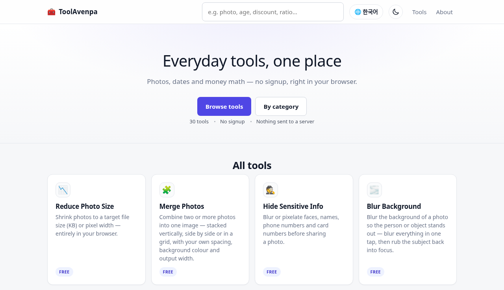

**도구를 만들어 씁니다.** 브라우저에서 바로 쓰는 것들.

[tool.avenpa.com](https://tool.avenpa.com) &nbsp;·&nbsp; [www.avenpa.com](https://www.avenpa.com) &nbsp;·&nbsp; [contact@avenpa.com](mailto:contact@avenpa.com)

 

## ToolAvenpa

사진·날짜·돈 계산 도구 30개. 가입 없고, 파일은 서버로 올라가지 않습니다.
`Astro` `TypeScript` `Cloudflare Workers` &nbsp;·&nbsp; [소스 보기](https://github.com/avenpa/tool-avenpa)

 

## 쓰는 것

`Python` `JavaScript` `TypeScript` `Astro` `Node.js` `Linux` `SQLite` `Cloudflare` `systemd`

 

avenpa &nbsp;·&nbsp; <a href="mailto:contact@avenpa.com">contact@avenpa.com</a>

